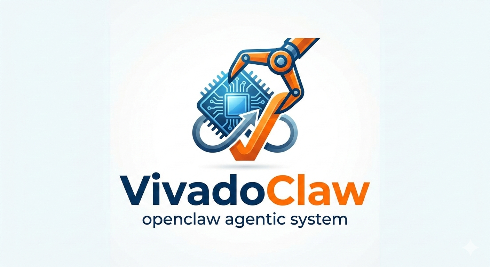

<p align="center">
  
</p>

# VivadoClaw

AI-assisted Vivado FPGA workflows, built for **[vivadoclaw.ai](https://vivadoclaw.ai)**.

> **Alpha** — Vivado init/simulation and Vitis HLS init/simulation workflows now work end-to-end. HLS synthesis/cosim/export and downstream Vivado implementation flows are the next layer.

## Try it on vivadoclaw.ai

The easiest way to use VivadoClaw is through **[vivadoclaw.ai](https://vivadoclaw.ai)** — no local setup required.

**1. Onboard**

```bash
openclaw onboard
```

**2. Start the gateway**

```bash
openclaw gateway
```

> **Do not** run `openclaw gateway install` — the systemd service is not enabled on this environment. Just run the gateway directly.

**3. Chat with your channel**

Once the gateway is running, talk to your connected channel:

- *"Create a Vivado project for Basys3 with my top.v file"*
- *"Run behavioral simulation on my UART module"*
- *"Initialize a project with xc7a35tcpg236-1 and these source files"*

OpenClaw picks the right workflow, runs Vivado, and returns the results.

## Running locally

If you want to run workflows outside of vivadoclaw.ai, you'll need to set up the full stack yourself:

- [OpenClaw](https://github.com/openclaw/openclaw) / [Lobster](https://github.com/openclaw/lobster) with `OPENCLAW_URL` and `OPENCLAW_TOKEN`
- Vivado (AMD/Xilinx) in a container
- jq, curl

```bash
export OPENCLAW_URL=http://127.0.0.1:18789
export OPENCLAW_TOKEN=<your-token>

~/lobster/bin/lobster.js run --file vivado-workflow/workflows/init.lobster --args-json '{
  "project_name": "my_proj",
  "part": "xc7a35tcpg236-1",
  "project_dir": "/home/appuser/projects/my_proj",
  "top_module": "top",
  "sources_json": "[{\"path\":\"/home/appuser/rtl/top.v\",\"type\":\"verilog\",\"library\":\"work\"}]"
}'
```

See [docs/init-workflow.md](vivado-workflow/docs/init-workflow.md) for full documentation.

## How it works

The LLM never touches Vivado directly. Each workflow orchestrates small Tcl scripts and uses `llm-task` to review results between steps.

```
OpenClaw  --->  Lobster Workflow  --->  step 1: Tcl Script (Vivado action)
                                  --->  step 2: Tcl Script (Vivado action)
                                  --->  step 3: llm-task  (AI review)
                                  --->  step 4: Tcl Script (apply patches)
                                  --->  ...
```

## Workflows

### Vivado

| Workflow | Status | Description |
|----------|--------|-------------|
| `vivado-workflow/workflows/init.lobster` | **Done** | Create project, add sources/constraints, AI review |
| `vivado-workflow/workflows/sim.lobster` | **Done** | Behavioral simulation with AI-assisted review |
| `vivado-workflow/workflows/synth.lobster` | Planned | Run synthesis with AI-assisted error diagnosis |
| `vivado-workflow/workflows/impl.lobster` | Planned | Place & route with timing review |
| `vivado-workflow/workflows/bitstream.lobster` | Planned | Bitstream generation with final checks |

### Vitis HLS

| Workflow | Status | Description |
|----------|--------|-------------|
| `vitis-workflow/workflows/init-core.lobster` | **Done** | Stable HLS project initialization with result-file step handoff |
| `vitis-workflow/workflows/init.lobster` | **Done** | HLS init plus AI review/auto-patch layer |
| `vitis-workflow/workflows/sim.lobster` | **Done** | C simulation (`csim_design`) with structured state capture and final AI review |
| `vitis-workflow/workflows/synth.lobster` | **Done** | HLS synthesis (`csynth_design`) with report extraction and final AI review |
| `vitis-workflow/workflows/cosim.lobster` | **Done** | C/RTL co-simulation (`cosim_design`) with simulator/report capture and final AI review |
| `vitis-workflow/workflows/export.lobster` | **Done** | RTL/IP export (`export_design`) with packaging artifact capture and final AI review |

## Vitis HLS Notes

Recent validation work established a few practical rules:

- `vitis_hls -f <script.tcl>` works reliably in batch mode
- the stable init path is `vitis-workflow/workflows/init-core.lobster`
- result-file handoff between steps is more reliable than scraping JSON from stdout
- the review path in `vitis-workflow/workflows/init.lobster` now also completes end-to-end for a validated `vector_add` example
- `vitis-workflow/workflows/sim.lobster` now runs `csim_design`, captures structured simulation state, and finishes with a report-only AI review
- `vitis-workflow/workflows/synth.lobster` now runs `csynth_design`, extracts timing/resource summaries, and finishes with a report-only AI review
- `vitis-workflow/workflows/cosim.lobster` now runs `cosim_design`, captures simulator/report state, and finishes with a report-only AI review
- `vitis-workflow/workflows/export.lobster` now runs `export_design`, captures packaging artifacts, and finishes with a report-only AI review

See `vitis-workflow/docs/init-workflow.md`, `vitis-workflow/docs/sim-workflow.md`, `vitis-workflow/docs/synth-workflow.md`, `vitis-workflow/docs/cosim-workflow.md`, and `vitis-workflow/docs/export-workflow.md` for details.

## Structure

```
vivado-workflow/
  workflows/        Lobster workflow definitions for Vivado
  scripts/          Shell wrappers + Tcl scripts (one per Vivado action)
  schemas/          JSON schemas for structured LLM output
  prompts/          LLM review prompts
  docs/             Per-workflow documentation

vitis-workflow/
  workflows/        Lobster workflow definitions for Vitis HLS
  scripts/          Shell wrappers + Tcl scripts (one per HLS action)
  schemas/          JSON schemas for structured LLM output
  prompts/          LLM review prompts
  docs/             Per-workflow documentation
```

---

For questions or feedback, contact:
- **Email:** Sihun Lim — 2002nare@snu.ac.kr
- **Telegram:** [@7232766007](https://t.me/7232766007)

## License

[MIT](LICENSE)
