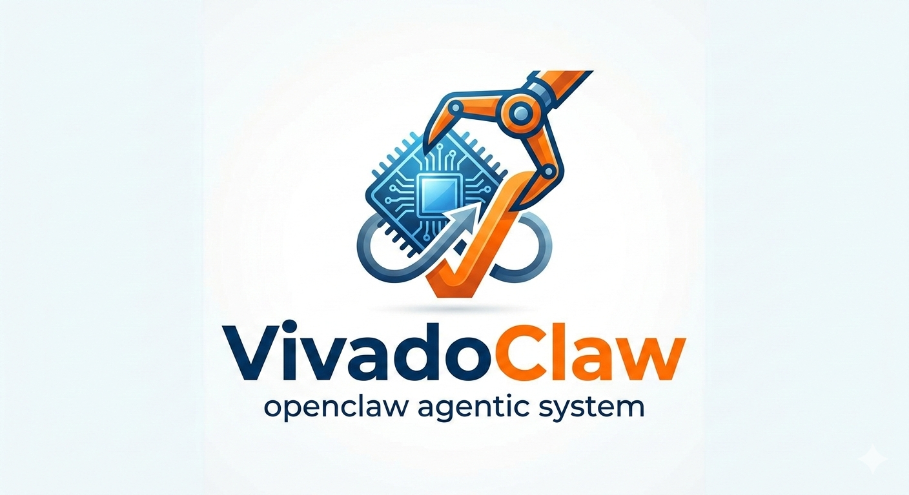

<p align="center">
  
</p>

# RTLclaw

AI-assisted Vivado FPGA workflows, built for **[vivadoclaw.ai](https://vivadoclaw.ai)**.

> Vivado (init, simulation, implementation/bitstream), Vitis HLS (init, simulation, synthesis, cosim, export), and spec review/refine tools — all working end-to-end.

## Try it on vivadoclaw.ai

The easiest way to use RTLclaw is through **[vivadoclaw.ai](https://vivadoclaw.ai)** — no local setup required.

**1. Onboard**

```bash
openclaw onboard
```

**2. Start the gateway**

```bash
openclaw gateway
```

> **Do not** run `openclaw gateway install` — the systemd service is not enabled on this environment. Just run the gateway directly.

**3. Chat with your channel**

Once the gateway is running, talk to your connected channel:

- *"Create a Vivado project for Basys3 with my top.v file"*
- *"Run behavioral simulation on my UART module"*
- *"Initialize a project with xc7a35tcpg236-1 and these source files"*

OpenClaw picks the right workflow, runs Vivado, and returns the results.

## Running locally

If you want to run workflows outside of vivadoclaw.ai, you'll need to set up the full stack yourself:

- [OpenClaw](https://github.com/openclaw/openclaw) / [Lobster](https://github.com/openclaw/lobster) with `OPENCLAW_URL` and `OPENCLAW_TOKEN`
- Vivado (AMD/Xilinx) in a container
- jq, curl

```bash
export OPENCLAW_URL=http://127.0.0.1:18789
export OPENCLAW_TOKEN=<your-token>

~/lobster/bin/lobster.js run --file vivado-tool/tools/init.lobster --args-json '{
  "project_name": "my_proj",
  "part": "xc7a35tcpg236-1",
  "project_dir": "/home/appuser/projects/my_proj",
  "top_module": "top",
  "sources_json": "[{\"path\":\"/home/appuser/rtl/top.v\",\"type\":\"verilog\",\"library\":\"work\"}]"
}'
```

See [docs/init-tool.md](vivado-tool/docs/init-tool.md) for full documentation.

## How it works

The LLM never touches Vivado directly. Each workflow orchestrates small Tcl scripts and uses `llm-task` to review results between steps.

```
OpenClaw  --->  Lobster Workflow  --->  step 1: Tcl Script (Vivado action)
                                  --->  step 2: Tcl Script (Vivado action)
                                  --->  step 3: llm-task  (AI review)
                                  --->  step 4: Tcl Script (apply patches)
                                  --->  ...
```

## End-to-end AI Agent example

The `examples/` directory includes a full **AI Agent-driven hardware development example**: spec definition, testbench planning, RTL generation, simulation, synthesis, implementation, and bitstream generation — all in one pipeline.

See [`examples/spi_slave_basys3_from_spec/`](examples/spi_slave_basys3_from_spec/docs/README.md) for the SPI slave bring-up example on Basys3.

## Modules

| Module | Description | README |
|--------|-------------|--------|
| [`vivado-tool/`](vivado-tool/) | Vivado project init, simulation, implementation tools | [README](vivado-tool/README.md) |
| [`vitis-tool/`](vitis-tool/) | Vitis HLS init, simulation, synthesis, cosim, export tools | [README](vitis-tool/README.md) |
| [`spec-tool/`](spec-tool/) | Hardware spec review and auto-refinement tools | [README](spec-tool/README.md) |
| [`spec-stage/`](spec-stage/) | Spec templates, schemas, examples, and domain knowledge | [README](spec-stage/README.md) |

---

For questions or feedback, contact:
- **Email:** Sihun Lim — 2002nare@snu.ac.kr
- **Telegram:** [@7232766007](https://t.me/7232766007)

## License

[MIT](LICENSE)
